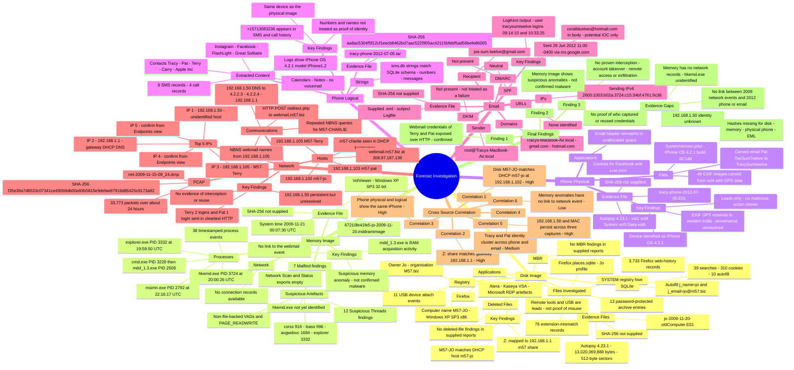

# Consolidated Forensic Investigation Mind Map

```mermaid
mindmap
  root((Forensic Investigation))
    Disk Image
      Evidence Files
        jo-2009-11-20-oldComputer.E01
        Autopsy 4.23.1 - 13,020,069,888 bytes - 512-byte sectors
        SHA-256 not supplied
      Files Investigated
        Firefox places.sqlite - Jo profile
        SYSTEM registry hive
        76 extension-mismatch records
        12 password-protected archive entries
      Registry
        Computer name M57-JO - Windows XP SP3 x86
        Owner Jo - organisation M57.biz
        11 USB device attach events
      SQLite
        3,733 Firefox web-history records
        39 searches - 310 cookies - 10 autofill
        Autofill j_name=jo and j_email=jo@m57.biz
      Deleted Files
        No deleted-file findings in supplied reports
      MBR
        No MBR findings in supplied reports
      Applications
        Firefox
        Atera - Kaseya VSA - Microsoft RDP artefacts
      Key Findings
        M57-JO matches DHCP host m57-jo
        Z: mapped to 192.168.1.1 m57 share
        Remote tools and USB are leads - not proof of misuse

    Memory Image
      Evidence File
        67210fe41fe5-jo-2009-11-20.mddramimage
        VolViewer - Windows XP SP3 32-bit
        System time 2009-11-21 00:07:30 UTC
        SHA-256 not supplied
      Processes
        38 timestamped process events
        explorer.exe PID 3332 at 19:59:50 UTC
        hkemd.exe PID 3724 at 20:00:26 UTC
        msimn.exe PID 2792 at 22:16:17 UTC
        cmd.exe PID 3228 then mdd_1.3.exe PID 2508
      Network
        Network Scan and Status exports empty
        No connection records available
      Suspicious Artefacts
        7 Malfind findings
        12 Suspicious Threads findings
        Non-file-backed VADs and PAGE_READWRITE
        csrss 916 - lsass 996 - avgwdsvc 1684 - explorer 3332
        hkemd.exe not yet identified
      Key Findings
        Suspicious memory anomaly - not confirmed malware
        mdd_1.3.exe is RAM acquisition activity
        No link to the webmail event

    Phone Physical
      Evidence File
        tracy-phone-2012-07-05.E01
        Autopsy 4.23.1 - vol1 vol4 System vol5 Data vol6
        SHA-256 not supplied
      Applications
        Cookies for Facebook and Live.com
        Email header remnants in unallocated space
      Files
        SystemVersion.plist - iPhone OS 4.2.1 build 8C148
        49 EXIF images carved from vol4 with GPS data
        Carved email Pat TeeSumTwelve to TracySumtwelve
      Key Findings
        Device identified as iPhone OS 4.2.1
        EXIF GPS resolves to western India - provenance unresolved
        Leads only - no malicious action shown

    Phone Logical
      Evidence File
        tracy-phone-2012-07-05.tar
        SHA-256 aa8ac5304f5f12cf1eecb8462bd7aac5225f05ac42115bfebf5ad56befe86005
      Extracted Content
        8 SMS records - 4 call records
        Contacts Tracy - Pat - Terry - Carry - Apple Inc
        Calendars - Notes - no voicemail
        Instagram - Facebook - FlashLight - Great Solitaire
        Logs show iPhone OS 4.2.1 model iPhone1,2
      Strings
        sms.db strings match SQLite schema - numbers - messages
      Key Findings
        +15713083236 appears in SMS and call history
        Same device as the physical image
        Numbers and names not treated as proof of identity

    Email
      Evidence File
        Supplied .eml - subject Logfile
        SHA-256 not supplied
      Sender
        root@Tracys-MacBook-Air.local
      Recipient
        joe.sum.twelve@gmail.com
      SPF
        Neutral
      DKIM
        Not present - not treated as a failure
      DMARC
        Not present
      IPs
        Sending IPv6 2600:1003:b02a:3724:c15:34bf:4761:9c36
      URLs
        None identified
      Domains
        Tracys-MacBook-Air.local - gmail.com - hotmail.com
      Key Findings
        Sent 29 Jun 2012 11:00 -0400 via mx.google.com
        LogKext output - user tracysumtwelve logins 09:14:10 and 10:33:25
        coralbluetwo@hotmail.com in body - potential IOC only

    Network
      PCAP
        net-2009-11-15-09_24.dmp
        33,773 packets over about 24 hours
        SHA-256 f35e39a7d8533c07341ce490b9db00a93b5815e9defae87919d85425c9173a92
      Top 5 IPs
        IP 1 - 192.168.1.50 - unidentified host
        IP 2 - 192.168.1.1 - gateway DHCP DNS
        IP 3 - 192.168.1.105 - M57-Terry
        IP 4 - confirm from Endpoints view
        IP 5 - confirm from Endpoints view
      Hosts
        192.168.1.102 m57-jo
        192.168.1.103 m57-pat
        192.168.1.105 M57-Terry
        m57-charlie seen in DHCP hostnames
        webmail.m57.biz at 208.97.187.139
      Communications
        HTTP POST redirect.php to webmail.m57.biz
        192.168.1.50 DNS to 4.2.2.3 - 4.2.2.4 - 192.168.1.1
        NBNS webmail names from 192.168.1.105
        Repeated NBNS queries for M57-CHARLIE
      Key Findings
        Terry 2 logins and Pat 1 login sent in cleartext HTTP
        No evidence of interception or reuse
        192.168.1.50 persistent but unresolved

    Cross Source Correlation
      Correlation 1
        Disk M57-JO matches DHCP m57-jo at 192.168.1.102 - High
      Correlation 2
        Z: share matches gateway 192.168.1.1 - High
      Correlation 3
        Phone physical and logical show the same iPhone - High
      Correlation 4
        Tracy and Pat identity cluster across phone and email - Medium
      Correlation 5
        192.168.1.50 and MAC persist across three captures - High
      Correlation 6
        Memory anomalies have no link to network event - Low

    Final Findings
      Finding 1
        Webmail credentials of Terry and Pat exposed over HTTP - confirmed
      Finding 2
        Memory image shows suspicious anomalies - not confirmed malware
      Finding 3
        No proven interception - account takeover - remote access or exfiltration
      Evidence Gaps
        No proof of who captured or reused credentials
        Memory has no network records - hkemd.exe unidentified
        192.168.1.50 identity unknown
        No link between 2009 network events and 2012 phone or email
        Hashes missing for disk - memory - physical phone - EML
```
